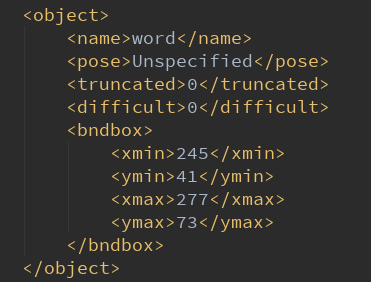
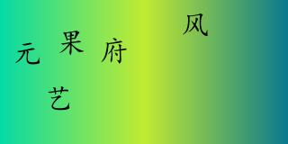
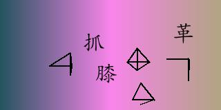
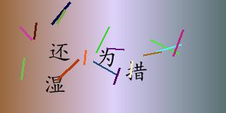

# generate_click_captcha

使用本程序可以生成点选验证码的图片，可以通过修改参数自定义字体、字数、干扰线、虚构的文字对象等。  
通过本程序批量生成图片后，同时可以生成标注的标签（json、xml）用于图像识别的训练，xml格式兼容yolo。  
本项目可以用于人机验证，也可以用于验证码识别的研究。  

  

  


## 1. 例子
创建点选中文验证码有两个必要条件，一是指定字体，二是自定常用字的列表。  
我们一般把常用字列表存在某个文件中，下面的简单的例子：  
```
from code.click_captcha import ClickCaptcha

font_path="C:/windows/fonts/simkai.ttf"
word_list_file_path="data/chinese_word.json"

# 创建对象
c = ClickCaptcha(font_path=font_path, word_list_file_path=word_list_file_path)

# 创建图片、展示、保存
c.create_image()
c.show()
c.save("test.jpg")
```
运行后可以看到类似下面的图像：  
  

## 2. 配置
下面是最主要的几项配置，包括添加文字、添加干扰线、添加虚构的文字对象：  
```
# 配置开关
c.enable_add_text = True  # 添加文字
c.enable_interference_line = True  # 添加干扰线，默认为False
c.enable_dummy_word = True  # 添加虚构文字对象，默认为False
```
  

还有其他配置，包括干扰线的长度、颜色、数量，虚拟文字的定义，图像的大小等  
都可以在code/click_captcha.py中的__init__函数里面找到对应的注释，然后在创建对象后进行重写：  
例如修改图像尺寸：  
```
from code.click_captcha import ClickCaptcha

# 创建对象
c = ClickCaptcha(font_path=font_path, word_list_file_path=word_list_file_path)
c.width = 320  # 宽度
c.height = 160  # 高度

c.create_image()
c.save("test.jpg")
```

## 3. 批量保存
有一个重要的功能：批量保存，同时保存标签：  
```
from code.click_captcha import ClickCaptcha

# 创建对象
c = ClickCaptcha(font_path=font_path, word_list_file_path=word_list_file_path)
c.label_type = "xml"  # 标签类型

# 指定一下保存的路径，不指定会有默认路径
c.save_img_dir = "image245/img"
c.save_label_dir = "image245/label"

# 开始批量创建
c.create_image_by_batch(10)
```
你会发现image245路径下面多了图片和标签的文件夹。  


